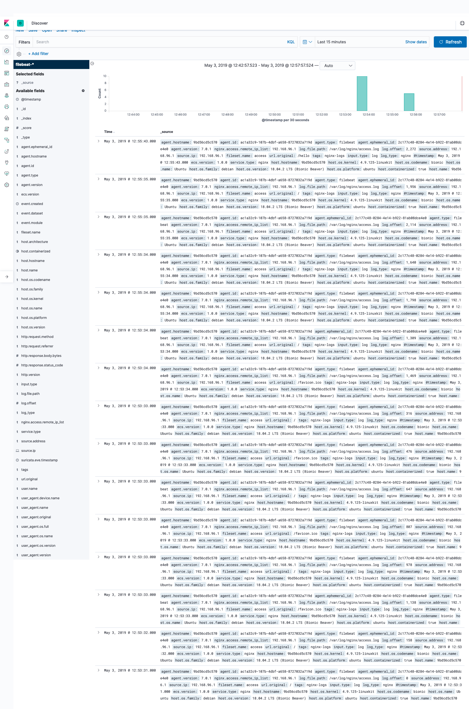
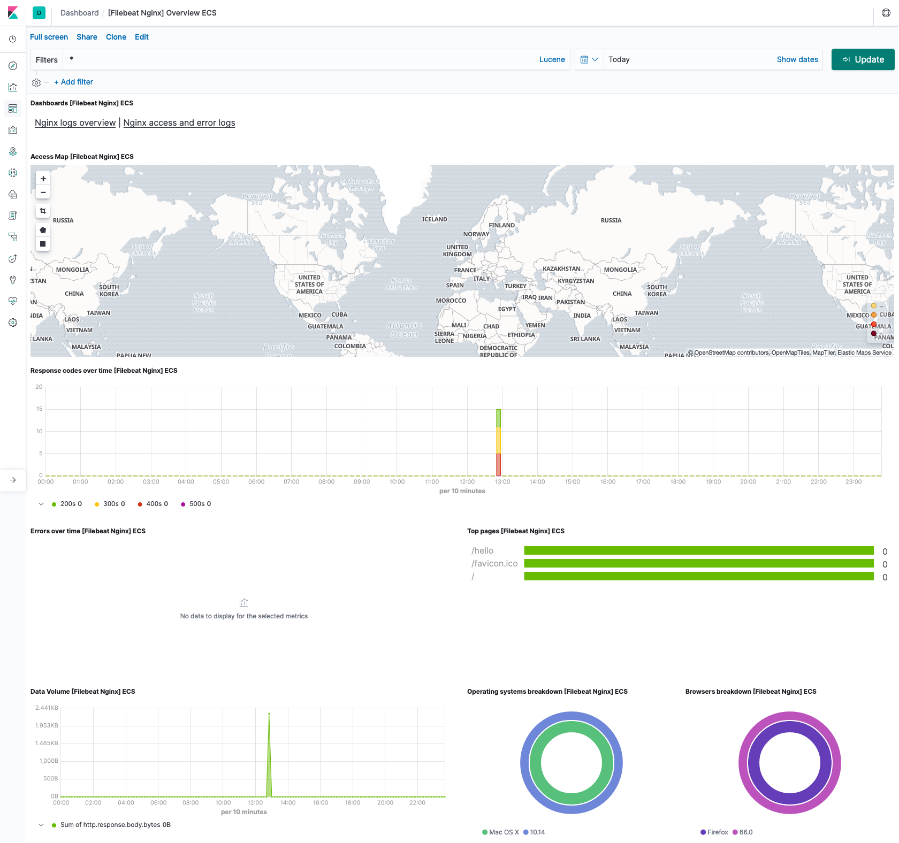
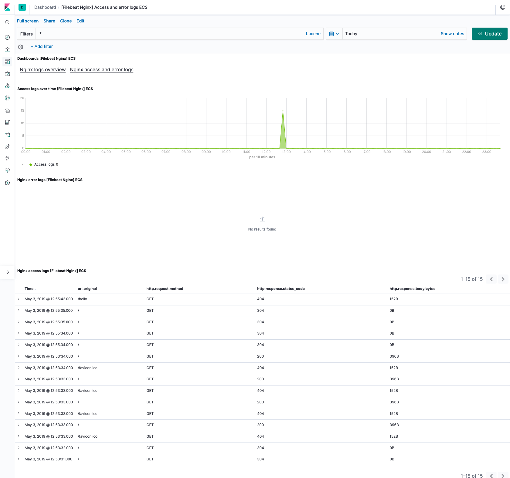

# EMBL EBI Webserver Centralized logging Demo

This will be a short demo on centralized logging of Nginx logs. 

# Architecture
The components used for this demo to accomplish centralized logging are,
  - *Elasticsearch* for storing and indexing the logs
  - *filebeat* to ship the logs to Elasticsearch
  - *Nginx* server which will produce the logs

To make it easier to reproduce it locally, we have containerized all of the above components.

# Pre-requisites
You'll need,
  - Latest version of docker. Refer [Installing Docker](https://docs.docker.com/install/)
  - Latest version of docker-compose. Refer [Installing Docker-Compose](https://docs.docker.com/compose/install/)

## Launch it!
To launch the demo, you can just run
```sh
./elk.sh start
```
This will pull the relevant docker images if not present locally and start those. 

## Access the App and Kibana 
- You can hit the app served by nginx instance using port 8080 ( http://localhost:8080 )
- You can access Kibana dashboard using port 5061 ( http://localhost:5601 )

## Stop the Demo
You can stop the demo by running
```sh
./elk.sh stop
```

## Destroy the Demo environment
Once you have done testing, you an destroy the containers created for this demo by running,
```sh
./els.sh destroy
```

## Troubleshooting
If you are not seeing the logs in Kibana dashobard, make sure nginx and filebeat service are running. You can verify it by running,
```sh
$ docker exec -it ebi_nginx_1 bash -c "service filebeat status"
 * filebeat is not running
 ```
 If not running, you can start the server using the below command
```sh
$ docker exec -it ebi_nginx_1 bash -c "service filebeat start"
```

## Screenshots

**Nginx Logs**


**Nginx Logs Overview**


**Nginx Access and Error overview**

